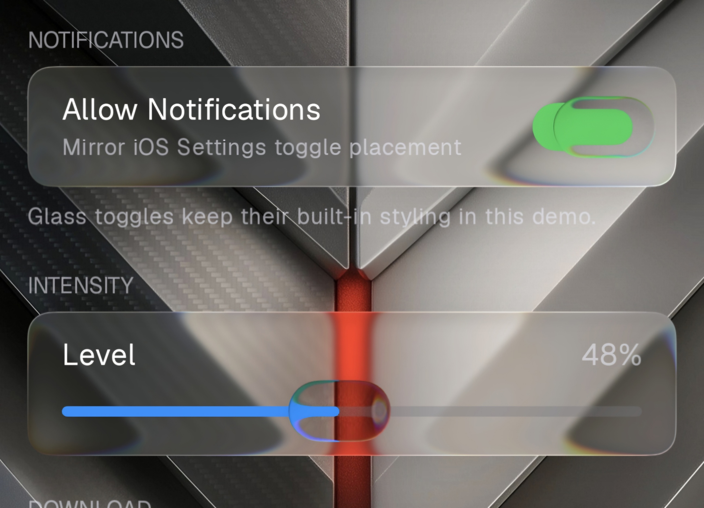
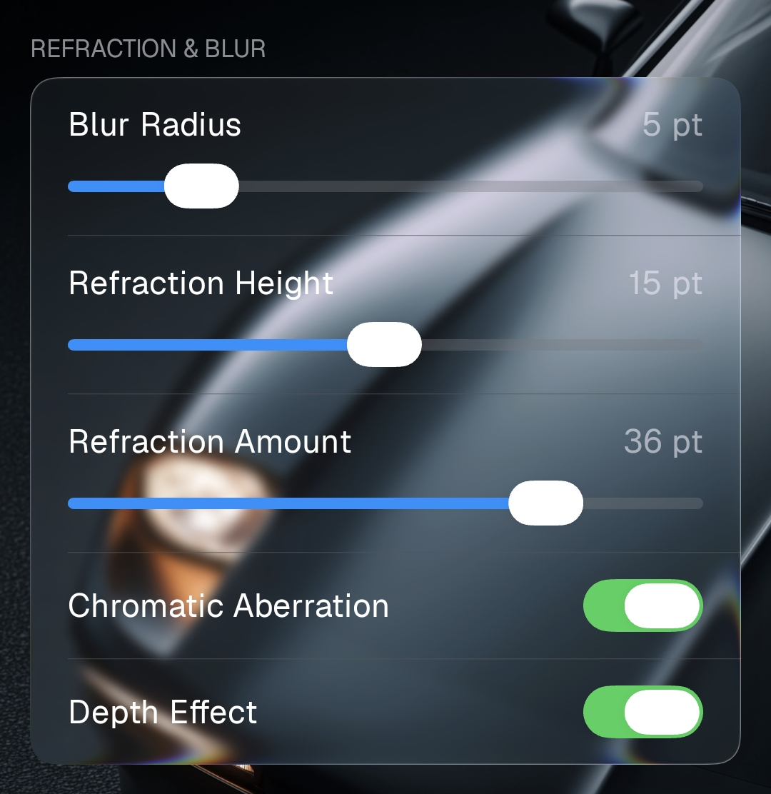
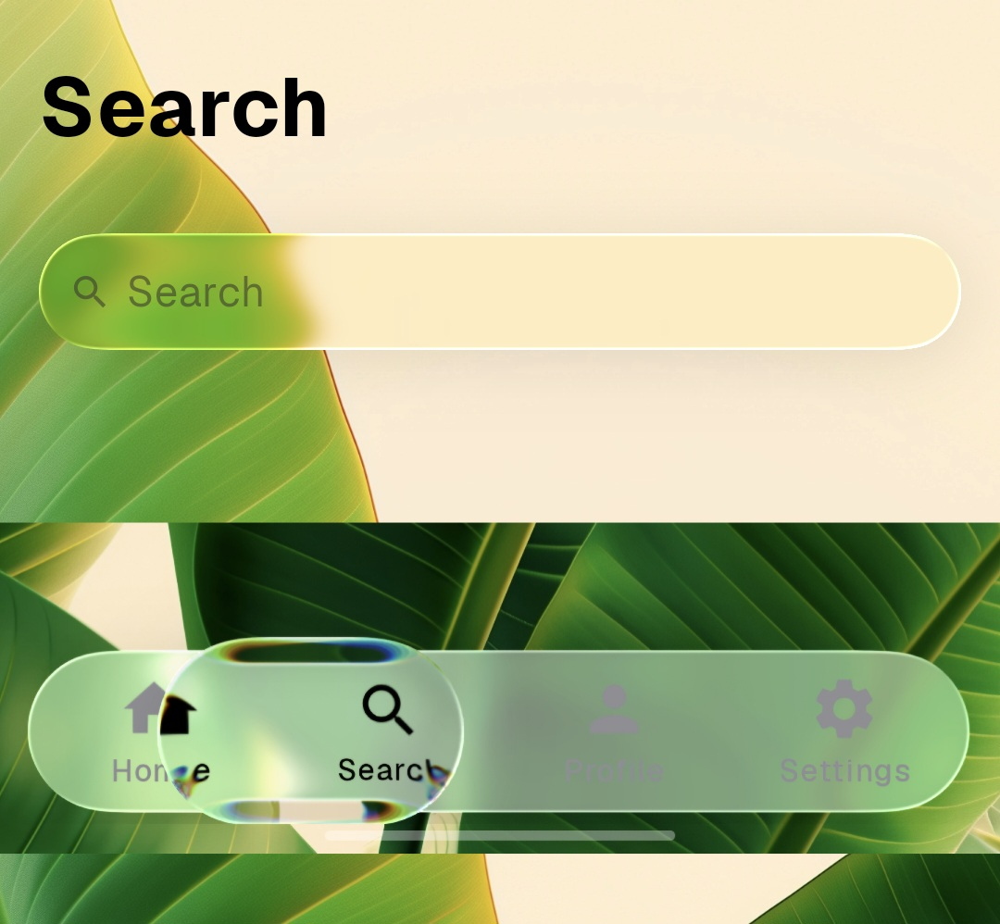
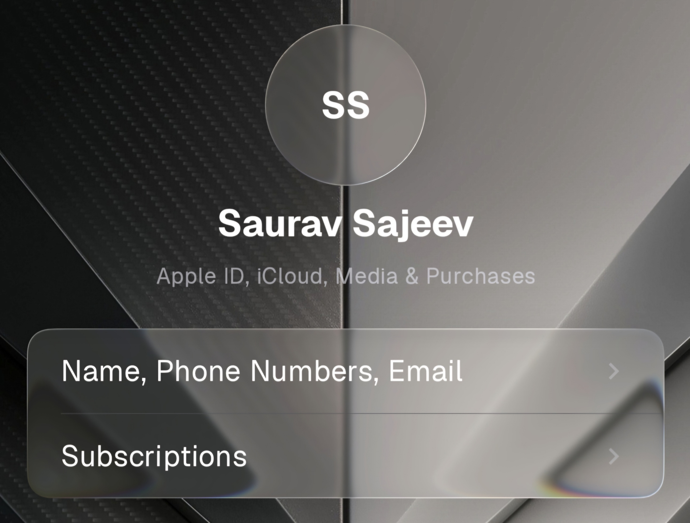
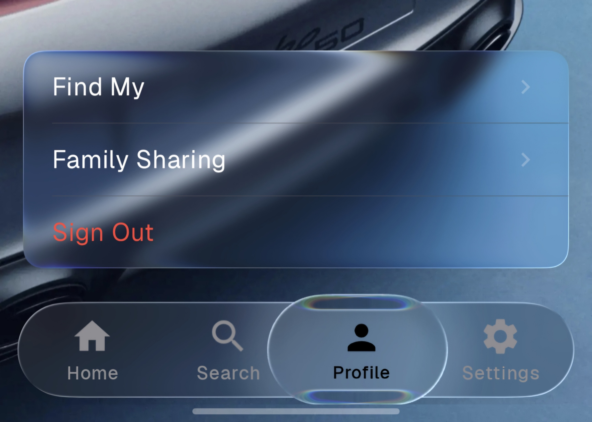
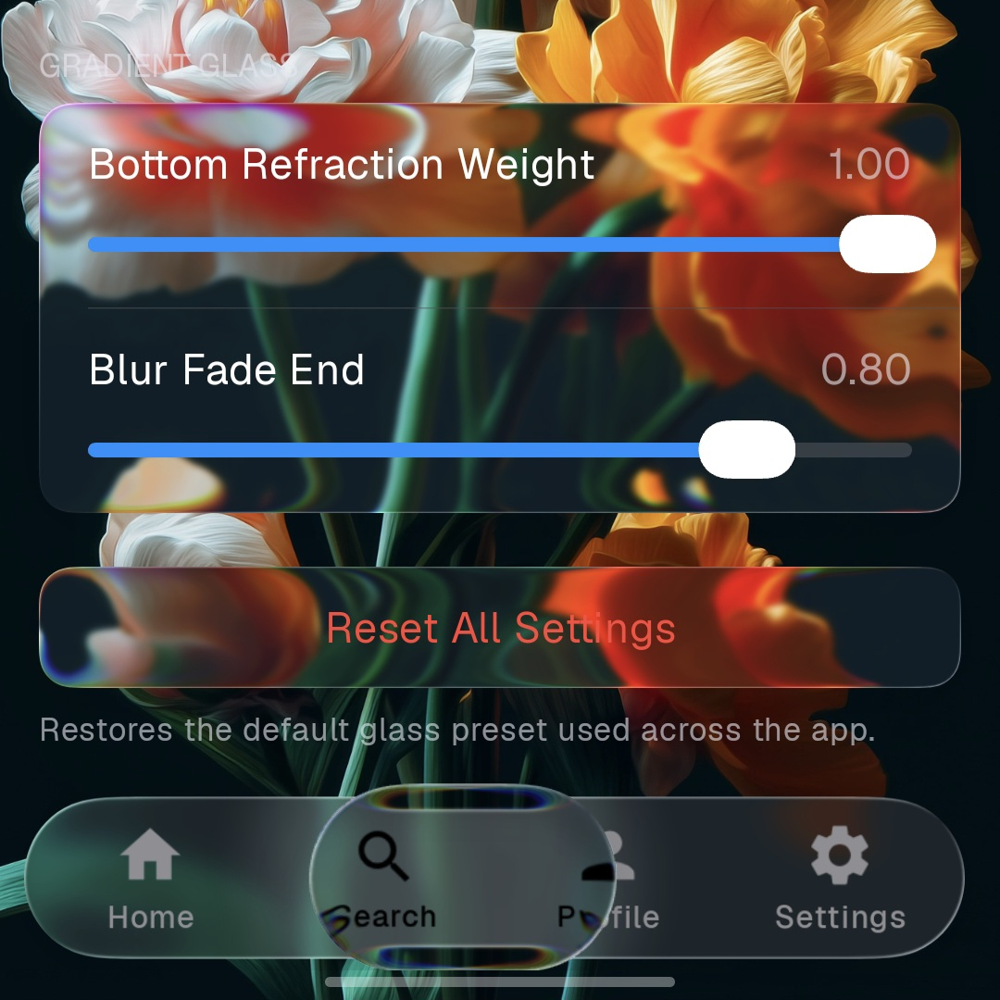
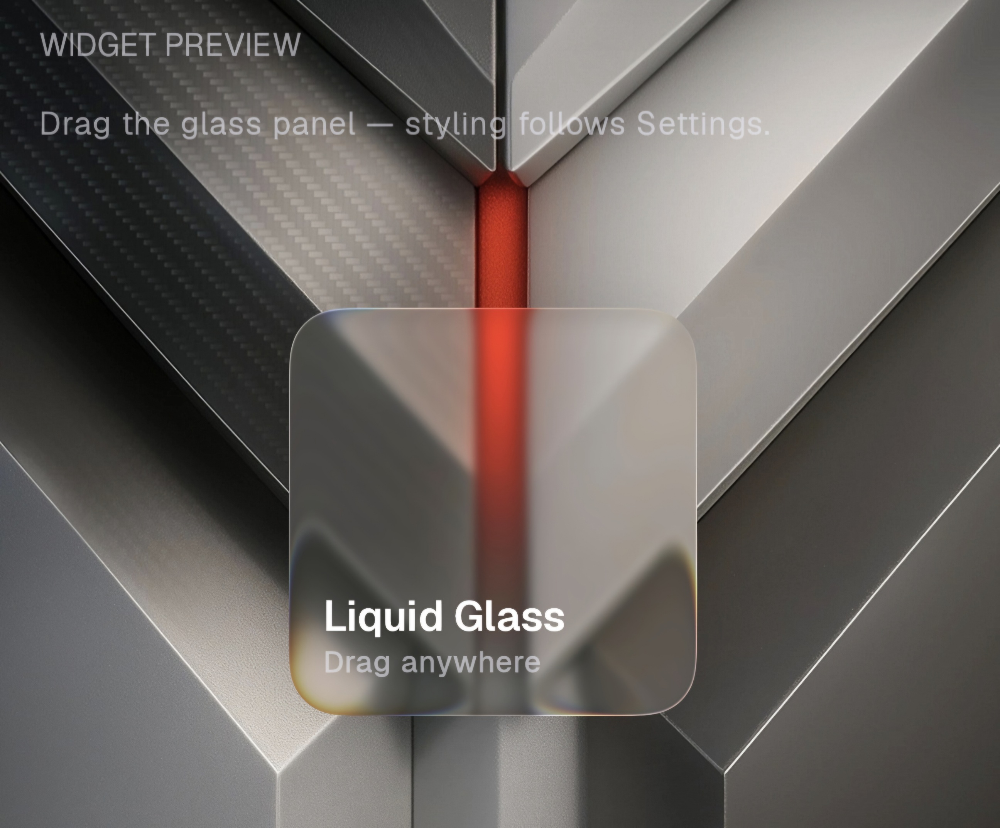
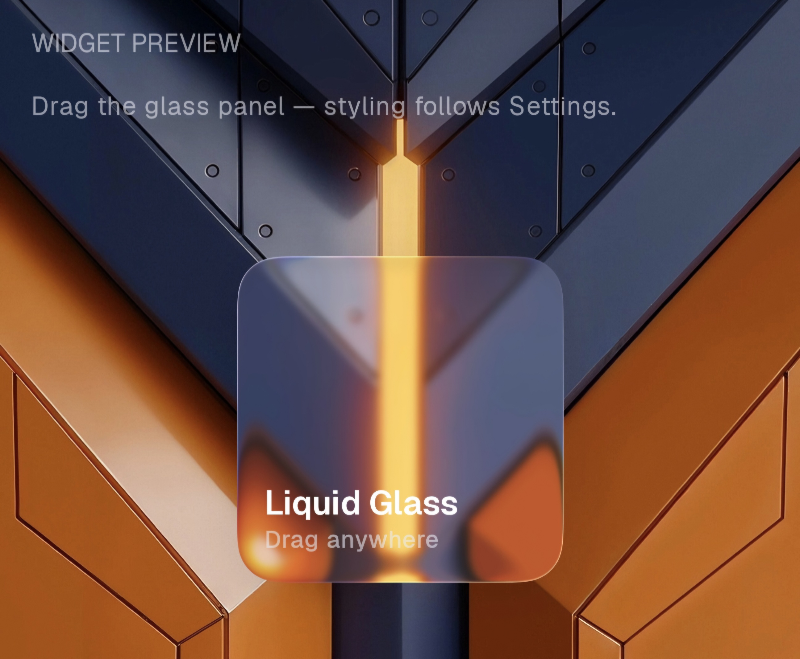

# Prismal - Liquid Glass for Android (Jetpack)

**High Performance Liquid glass for Jetpack Compose** — backdrop sampling, blur, edge refraction, specular highlights, and interactive glass controls with automatic degradation on older Android versions.

[Download Demo App](https://pub-3b102de89d7542a8bfd005af12dd955c.r2.dev/PrismalAGSL%20Demo.apk)

[](https://jitpack.io/#styropyr0/PrismalAGSL)
[](LICENSE)
[](https://developer.android.com/about/versions/nougat)
[](https://developer.android.com/jetpack/compose)

Prismal brings an iOS-style liquid glass look to Android Compose apps. Glass surfaces sample live content behind them, refract it at the edges, and respond to touch with spring physics and press ripples. On devices that cannot run AGSL shaders or `RenderEffect`, the library falls back gracefully so you ship one API everywhere.

> **Successor to [Prismal (OpenGL ES)](https://github.com/styropyr0/Prismal)**  
> The original [styropyr0/Prismal](https://github.com/styropyr0/Prismal) library is still available. It targets the View system and renders glass effects with **OpenGL ES**. This repo (**PrismalAGSL**) is the Compose reimplementation: same visual language and component ideas, rebuilt on **AGSL**, `RenderEffect`, and Compose-first APIs. Use the original if you need OpenGL ES on Views; use this library for Jetpack Compose.

## Screenshots

| |                                                                                |
|:---:|:------------------------------------------------------------------------------:|
| Browse — toggle & slider |                           Refraction & blur settings                           |
|  |  |
| Search |                                    Profile                                     |
|  |                                    |
| Profile menu & tabs |                           Horizontal Scroll Selector                           |
|  |        |
| Widget preview |                          Widget preview — refraction                           |
|  |    |

---

## Table of contents

- [Screenshots](#screenshots)
- [Relation to Prismal (OpenGL ES)](#relation-to-prismal-opengl-es)
- [Features](#features)
- [Platform tiers](#platform-tiers)
- [Requirements](#requirements)
- [Installation](#installation)
- [Quick start](#quick-start)
- [Core concepts](#core-concepts)
- [Built-in components](#built-in-components)
- [Custom glass surfaces](#custom-glass-surfaces)
- [Effects API](#effects-api)
- [Shapes](#shapes)
- [Adaptive luminance](#adaptive-luminance)
- [Interactive primitives](#interactive-primitives)
- [Bottom tab bar](#bottom-tab-bar)
- [Horizontal selector](#horizontal-selector)
- [Demo app](#demo-app)
- [Project structure](#project-structure)
- [License](#license)
- [Links](#links)

---

## Relation to Prismal (OpenGL ES)

| | [Prismal](https://github.com/styropyr0/Prismal) | **PrismalAGSL** (this repo) |
|---|---|---|
| **UI** | Android Views | Jetpack Compose |
| **Rendering** | OpenGL ES | AGSL + `RenderEffect` + legacy frost fallback |
| **Status** | Maintained separately | Compose successor |
| **Repo** | [github.com/styropyr0/Prismal](https://github.com/styropyr0/Prismal) | [github.com/styropyr0/PrismalAGSL](https://github.com/styropyr0/PrismalAGSL) |

Both libraries share the same Prismal glass aesthetic (blur, refraction, interactive controls). APIs differ because this version is idiomatic Compose — modifiers, composables, and `PrismalBackdrop` layers instead of OpenGL ES surfaces on Views.

---

## Features

- **Backdrop-driven glass** — sample wallpaper, scrollable content, or other composables through frosted panels
- **Three automatic pipeline tiers** — Legacy frost (API 25–30), `RenderEffect` blur (API 31–32), full AGSL liquid glass (API 33+)
- **Edge lens refraction** — rounded-rectangle SDF shaders with optional chromatic aberration
- **Specular, depth shadow, and depth inset** — decorative layers on top of the refracted backdrop
- **Ready-made components** — buttons, toggles, sliders, progress bars, gradient panels, horizontal selector, and an iOS-style bottom tab bar with a draggable selection droplet
- **Custom glass builder** — `drawPrismalGlass`, `PrismalLiquidGlass`, and composable effect helpers
- **Adaptive luminance** — optional brightness sampling to tune blur and foreground contrast against the backdrop
- **Press interactions** — ripple, scale, and spring motion shared across components

---

## Platform tiers

Prismal selects a pipeline at runtime. You normally **do not** branch on this in app code — unsupported effects are skipped automatically.

| Tier | API | What you get |
|------|-----|--------------|
| **Legacy** | 25–30 | Sampled backdrop + frosted surface overlay (`legacyFrostStrength`) |
| **Standard** | 31–32 | Backdrop blur and color filters via `RenderEffect` |
| **Liquid** | 33+ | Full AGSL refraction, dispersion, gradient glass, custom runtime shaders |

Query capabilities when needed:

```kotlin
import com.styropyr0.prismal.PrismalGlass

PrismalGlass.pipeline              // Legacy | Standard | Liquid
PrismalGlass.supportsBackdropBlur  // API 31+
PrismalGlass.supportsRefraction    // API 33+
PrismalGlass.supportsAgslEffects   // API 33+
PrismalGlass.isSupported()         // API 25+
```

AGSL shader assets are loaded once at startup via AndroidX App Startup (`PrismalAgslInitializer`). No manual initialization is required.

---

## Requirements

| | |
|---|---|
| **minSdk** | 25 (Android 7.0) |
| **compileSdk** | 37+ recommended |
| **UI toolkit** | Jetpack Compose (library uses Compose BOM) |
| **Kotlin** | 2.x with Compose Compiler plugin |

The library depends on Compose Foundation and UI. Your app module must enable the Compose compiler:

```kotlin
plugins {
    id("org.jetbrains.kotlin.plugin.compose")
}
```

---

## Installation

### 1. Add JitPack

In `settings.gradle.kts`:

```kotlin
dependencyResolutionManagement {
    repositories {
        google()
        mavenCentral()
        maven(url = "https://jitpack.io")
    }
}
```

### 2. Add the dependency

Replace `TAG` with a [GitHub release tag](https://github.com/styropyr0/PrismalAGSL/releases) (for example `1.0.0`):

```kotlin
dependencies {
    implementation("com.github.styropyr0:PrismalAGSL:Prismal:TAG")
}
```

Artifact coordinates:

| Field | Value |
|-------|-------|
| `groupId` | `com.github.styropyr0` |
| `artifactId` | `Prismal` |
| `repo` | `PrismalAGSL` |

---

## Quick start

Every glass surface needs a **backdrop** — content that will be sampled and refracted. The usual pattern is a full-screen background layer plus glass UI on top.

```kotlin
import androidx.compose.foundation.layout.Box
import androidx.compose.foundation.layout.fillMaxSize
import androidx.compose.foundation.layout.padding
import androidx.compose.material3.Text
import androidx.compose.runtime.Composable
import androidx.compose.ui.Modifier
import androidx.compose.ui.unit.dp
import com.styropyr0.prismal.PrismalLiquidGlass
import com.styropyr0.prismal.components.PrismalGlassButton
import com.styropyr0.prismal.drawPrismalGlass
import com.styropyr0.prismal.prismalGlassEffects
import com.styropyr0.prismal.shapes.PrismalRoundedRectangle
import com.styropyr0.prismal.sources.prismalGlassLayer
import com.styropyr0.prismal.sources.rememberPrismalGlassLayer

@Composable
fun GlassDemoScreen() {
    val backdrop = rememberPrismalGlassLayer()

    Box(Modifier.fillMaxSize()) {
        // 1. Record backdrop content
        Wallpaper(
            modifier = Modifier
                .fillMaxSize()
                .prismalGlassLayer(backdrop)
        )

        // 2. Draw glass on top, sampling the backdrop
        PrismalGlassButton(
            onClick = { },
            backdrop = backdrop,
            modifier = Modifier
                .align(Alignment.Center)
                .padding(24.dp)
        ) {
            Text("Hello Glass")
        }
    }
}
```

For a panel with the standard liquid-glass recipe and no extra boilerplate:

```kotlin
import androidx.compose.ui.platform.LocalDensity
import com.styropyr0.prismal.drawPrismalGlass
import com.styropyr0.prismal.prismalGlassEffects

val density = LocalDensity.current

Box(
    Modifier
        .padding(16.dp)
        .drawPrismalGlass(
            backdrop = backdrop,
            shape = { PrismalRoundedRectangle(24.dp) },
            effects = prismalGlassEffects(density)
        )
) {
    Text("Custom panel", modifier = Modifier.padding(20.dp))
}
```

---

## Core concepts

### Backdrop (`PrismalBackdrop`)

A pixel source that glass surfaces sample. Implementations include:

| API | Purpose |
|-----|---------|
| `rememberPrismalGlassLayer()` | Captures a composable subtree via `Modifier.prismalGlassLayer()` |
| `rememberPrismalCanvasSource { }` | Procedural draw callback |
| `rememberPrismalMergedSource(a, b, …)` | Layers multiple sources |
| `rememberPrismalWrappedSource(source) { }` | Transform or filter an existing source |
| `emptyGlassSource()` | Transparent / empty sample |

Attach a layer to background content:

```kotlin
val backdrop = rememberPrismalGlassLayer()

BackgroundContent(
    modifier = Modifier
        .fillMaxSize()
        .prismalGlassLayer(backdrop)
)
```

Call `backdrop.readSamplingState()` (or use components that do this internally) so glass redraws once the layer is positioned.

### Glass modifiers

| Modifier | Description |
|----------|-------------|
| `Modifier.drawPrismalGlass(...)` | Full glass: effects + optional specular, depth shadow, depth inset |
| `Modifier.drawPlainPrismalGlass(...)` | Effects only — no decorative edge layers |

Both accept:

- `backdrop` — what to refract
- `shape` — clip shape (use `PrismalRoundedRectangle` or `PrismalCapsule` for lens effects)
- `effects` — `PrismalGlassEffectProvider` block (blur, lens, color controls, …)
- `onDrawSurface` / `onDrawBehind` / `onDrawFront` — custom drawing hooks
- `layerBlock` — optional `graphicsLayer` transform during sampling (press scale, etc.)

### Liquid glass preset

`PrismalLiquidGlass.applyBase()` applies the calibrated blur + vibrancy + refraction recipe used across the library. Build on it with `prismalGlassEffects`:

```kotlin
drawPrismalGlass(
    backdrop = backdrop,
    shape = { PrismalRoundedRectangle(20.dp) },
    effects = prismalGlassEffects(density, adaptiveLuminance = true, luminance = { 0.6f }) {
        // Optional overrides after the base recipe:
        colorControls(saturation = 1.8f)
    }
)
```

---

## Built-in components

All components take a `backdrop: PrismalBackdrop` and degrade effects automatically.

| Component | Package | Description |
|-----------|---------|-------------|
| `PrismalGlassSurface` | `com.styropyr0.prismal` | General glass container; optional click + tint |
| `PrismalGlassButton` | `…components` | Capsule button with press ripple |
| `PrismalGlassToggle` | `…components` | Spring-animated switch |
| `PrismalGlassSlider` | `…components` | Track + refracting thumb |
| `PrismalGlassProgressBar` | `…components` | Determinate or indeterminate track |
| `PrismalGradientGlassPanel` | `…components` | Vertical gradient blur / refraction panel |
| `PrismalHorizontalSelector` | `…components` | iOS-style camera-mode picker with fixed liquid droplet |
| `PrismalGlassBottomTabs` | `…components` | iOS-style tab bar with sliding liquid droplet |
| `PrismalGlassBottomTab` | `…components` | Single tab item for the bottom bar |

Example — toggle and slider:

```kotlin
PrismalGlassToggle(
    selected = { enabled },
    onSelect = { enabled = it },
    backdrop = backdrop
)

PrismalGlassSlider(
    value = { sliderValue },
    onValueChange = { sliderValue = it },
    valueRange = 0f..1f,
    visibilityThreshold = 0.01f,
    backdrop = backdrop,
    modifier = Modifier.fillMaxWidth()
)
```

Example — progress bar:

```kotlin
PrismalGlassProgressBar(
    progress = { downloadProgress }, // 0f..1f
    backdrop = backdrop,
    indeterminate = false,
    modifier = Modifier.fillMaxWidth()
)
```

---

## Custom glass surfaces

Use `PrismalGlassSurface` when you want a boxed layout with optional click handling:

```kotlin
PrismalGlassSurface(
    backdrop = backdrop,
    shape = { PrismalRoundedRectangle(16.dp) },
    onClick = { /* optional */ },
    tint = Color(0xFF5856D6),
    adaptiveLuminance = true,
    luminance = { luminanceState.luminance },
    modifier = Modifier.fillMaxWidth()
) {
    Text("Content inside glass", modifier = Modifier.padding(16.dp))
}
```

For full control, use `drawPrismalGlass` directly and compose specular / depth yourself:

```kotlin
import com.styropyr0.prismal.depth.PrismalDepthInset
import com.styropyr0.prismal.depth.PrismalDepthShadow
import com.styropyr0.prismal.specular.PrismalSpecular

Modifier.drawPrismalGlass(
    backdrop = backdrop,
    shape = { PrismalCapsule() },
    effects = {
        applyPrismalGlassEffects(
            density = density,
            adaptiveLuminance = false,
            luminance = 0.5f,
            blurRadiusPx = with(density) { 8.dp.toPx() },
            refractionHeightPx = with(density) { 12.dp.toPx() },
            refractionAmountPx = with(density) { 24.dp.toPx() },
            chromaticAberration = 0.2f
        )
    },
    specular = { PrismalSpecular.Default },
    depthShadow = { PrismalDepthShadow.Default },
    depthInset = { PrismalDepthInset(radius = 8.dp) },
    onDrawSurface = { drawRect(Color.White.copy(alpha = 0.08f)) }
)
```

---

## Effects API

Effects are configured inside a `PrismalGlassEffectProvider` receiver block.

| Function | Description |
|----------|-------------|
| `applyPrismalGlassEffects(...)` | Standard blur + vibrancy + lens chain |
| `prismalBlur(radiusPx)` | Gaussian backdrop blur (API 31+; frost fallback on Legacy) |
| `prismalLens(...)` | Edge refraction shader (API 33+, requires rounded shape). `chromaticAberration` is `[0, 1]` (`0.2` = 20% dispersion) |
| `prismalGradientGlass(...)` | Vertical gradient blur panel (API 33+) |
| `vibrancy()` | iOS-like saturation / brightness boost |
| `colorControls(brightness, contrast, saturation)` | Manual color grading |
| `colorFilter(filter)` | Arbitrary `ColorFilter` |
| `opacity(alpha)` | Alpha composite |
| `effect(renderEffect)` | Append a raw `RenderEffect` |
| `prismalAGSLShaderEffect(...)` | Custom AGSL runtime shader (API 33+) |

Legacy devices accumulate `legacyFrostStrength` when blur is requested but unavailable — a frosted overlay is drawn on the glass surface instead.

---

## Shapes

Lens refraction requires a shape that exposes corner radii to the shader.

| Shape | Notes |
|-------|-------|
| `PrismalRoundedRectangle(radius)` | Uniform corners; continuous curvature by default |
| `PrismalCapsule()` | Fully rounded ends — used by buttons and tab bar |
| `CornerBasedShape` | Supported by `prismalLens` with extracted radii |

Prefer `PrismalRoundedRectangle` over raw `RoundedCornerShape` when you need refraction — it implements `PrismalRoundedRectangularShape` with continuous iOS-like corners.

---

## Adaptive luminance

Sample backdrop brightness and tune glass + foreground automatically:

```kotlin
import com.styropyr0.prismal.effects.rememberPrismalAdaptiveLuminance

val luminanceState = rememberPrismalAdaptiveLuminance(
    enabled = true,
    source = backdropLayer,
    isLightTheme = !isSystemInDarkTheme()
)

PrismalGlassButton(
    onClick = { },
    backdrop = backdropLayer,
    adaptiveLuminance = true,
    luminance = { luminanceState.luminance }
) {
    Text(
        "Adaptive",
        color = luminanceState.contentColor
    )
}
```

When `enabled = false`, luminance freezes at `0.5` (neutral).

---

## Interactive primitives

Lower-level building blocks used by components:

| Class | Use |
|-------|-----|
| `PrismalPressRipple` | Touch ripple + press progress for specular and scale |
| `PrismalSpringMotion` | Spring drag controller for sliders, toggles, tab droplet |

Attach `PrismalPressRipple.modifier` and `gestureModifier` to a glass surface and read `pressProgress` in `layerBlock` or effect blocks.

---

## Bottom tab bar

`PrismalGlassBottomTabs` renders an iOS-style bar with a draggable liquid selection pill.

```kotlin
import com.styropyr0.prismal.components.LocalPrismalBottomTabHighlightedIndex
import com.styropyr0.prismal.components.PrismalGlassBottomTab
import com.styropyr0.prismal.components.PrismalGlassBottomTabs

var selectedTab by remember { mutableIntStateOf(0) }

PrismalGlassBottomTabs(
    selectedTabIndex = { selectedTab },
    onTabSelected = { selectedTab = it },
    backdrop = backdrop,
    tabsCount = 4,
    tintDropletContent = false,           // keep icon colors from tab content
    dropletContentTint = Color.Black,     // when tintDropletContent = true
    modifier = Modifier.padding(horizontal = 20.dp)
) {
    TabItem(index = 0, icon = homeIcon, label = "Home")
    TabItem(index = 1, icon = searchIcon, label = "Search")
    // …
}
```

**Highlight during drag** — use `LocalPrismalBottomTabHighlightedIndex` so icon colors follow the droplet while the thumb is down (the persisted `selectedTabIndex` updates on release):

```kotlin
@Composable
private fun RowScope.TabItem(index: Int, icon: ImageVector, label: String) {
    val highlighted = LocalPrismalBottomTabHighlightedIndex.current()
    val selected = highlighted == index

    PrismalGlassBottomTab(onClick = { /* update selectedTab */ }) {
        Icon(icon, contentDescription = label, tint = if (selected) Color.Black else Color.Gray)
        Text(label, color = if (selected) Color.Black else Color.Gray)
    }
}
```

**Droplet tint options**

| Setting | Behavior |
|---------|----------|
| `tintDropletContent = false` | Droplet shows actual tab icon/label colors |
| `tintDropletContent = true`, `dropletContentTint = null` | Default iOS blue (`#0088FF` / `#0091FF`) |
| `tintDropletContent = true`, custom color | Your color in both light and dark themes |

---

## Horizontal selector

`PrismalHorizontalSelector` is an iOS-style horizontal picker (camera mode switcher): a fixed liquid-glass droplet stays centered while items scroll underneath and snap into place on release.

### Text labels

Widths are measured synchronously with `TextMeasurer` — no layout flicker.

```kotlin
import com.styropyr0.prismal.components.PrismalHorizontalSelector
import com.styropyr0.prismal.specular.PrismalSpecular

var selectedMode by remember { mutableIntStateOf(1) }
val modes = listOf("VIDEO", "PHOTO", "PORTRAIT", "SLO-MO")

PrismalHorizontalSelector(
    labels = modes,
    selectedIndex = selectedMode,
    onSelected = { selectedMode = it },
    backdrop = backdrop,
    textStyle = MaterialTheme.typography.labelMedium,
    textColor = MaterialTheme.colorScheme.onSurface,
    adaptiveLuminance = true,
    luminance = { luminanceState.luminance },
    specular = { PrismalSpecular.Default },
    chromaticAberration = 0.2f, // 20% RGB dispersion on the droplet lens
    modifier = Modifier.fillMaxWidth(),
)
```

### Custom composables

Pass any item content; widths are measured once before layout.

```kotlin
PrismalHorizontalSelector(
    itemCount = items.size,
    selectedIndex = selectedIndex,
    onSelected = { selectedIndex = it },
    backdrop = backdrop,
    chromaticAberration = 0.2f,
) { index, focus ->
    // focus is 1f when centered, 0f when far away — use for alpha/scale, not layout changes
    Icon(items[index], contentDescription = null)
}
```

### Key parameters

| Parameter | Default | Description |
|-----------|---------|-------------|
| `labels` / `itemCount` | — | String list overload or item count for composable overload |
| `selectedIndex` | — | Currently selected item |
| `onSelected` | — | Called when scrolling settles on a new item |
| `backdrop` | — | Backdrop sampled through the droplet glass |
| `adaptiveLuminance` | `false` | Tune droplet blur/frost from [luminance](#adaptive-luminance) |
| `luminance` | `{ 0.5f }` | Normalized backdrop brightness in `[0, 1]` |
| `specular` | `PrismalSpecular.Default` | Specular highlight on the droplet |
| `chromaticAberration` | `0.2f` | Droplet lens RGB dispersion in `[0, 1]` (`0.2` = 20%) |
| `boldWhenFocused` | `true` | Text overload only — bold the centered label |
| `dropletEffects` | `null` | Custom effect block; replaces the default lens stack when set |
| `itemSpacing` | `6.dp` | Gap between items |
| `itemPadding` | `14.dp` | Horizontal padding included in each item width |
| `dropletExtraWidth` | `10.dp` | Extra width added around the focused item for the capsule |

### Behavior

| Feature | Description |
|---------|-------------|
| Fixed droplet | Centered `PrismalCapsule` glass with bottom-tab-style lens refraction |
| Scrolling items | Horizontal scroll with spring snap on release |
| Focus animation | Centered item scales up (0.9→1.0) and fades in (38%→100%) |
| Bold center label | Text overload bolds the focused label (`boldWhenFocused = false` to disable) |
| Squish on drag | Droplet stretches slightly while scrolling, springs back on snap |
| Chromatic aberration | Configurable RGB dispersion on the droplet lens (API 33+) |

---

## Demo app

The `:app` module in this repository is a catalog playground (not published to JitPack). It demonstrates:

- iOS-style grouped settings layout
- Glass buttons, toggles, sliders, and progress bars
- Horizontal selector (camera-mode style picker)
- Gradient glass panel and profile avatar
- Bottom tab bar with customizable droplet tint
- Custom wallpaper picker with persistence across app restarts
- Live glass parameter tuning in Settings

Run locally:

```bash
./gradlew :app:installDebug
```

---

## Project structure

```
Prismal/
├── components/          # Ready-made UI (buttons, tabs, slider, horizontal selector, …)
├── depth/               # Depth shadow and inset modifiers
├── effects/             # Blur, lens, gradient glass, color controls
├── interactive/         # Press ripple, spring motion, drag gestures
├── shapes/              # PrismalRoundedRectangle, PrismalCapsule, …
├── sources/             # Backdrop layers, merged sources, canvas source
├── specular/            # Edge highlight styles
├── DrawPrismalGlassModifier.kt
├── PrismalBackdrop.kt
├── PrismalGlassSurface.kt
├── PrismalLiquidGlass.kt
└── Platform.kt          # Pipeline tier detection
app/                     # Demo catalog (not published)
```

---

## License

This project is licensed under the **MIT License** — see [LICENSE](LICENSE).

---

## Links

- **GitHub (this repo):** [styropyr0/PrismalAGSL](https://github.com/styropyr0/PrismalAGSL)
- **Original Prismal (OpenGL ES):** [styropyr0/Prismal](https://github.com/styropyr0/Prismal)
- **JitPack:** [jitpack.io/#styropyr0/PrismalAGSL](https://jitpack.io/#styropyr0/PrismalAGSL)
